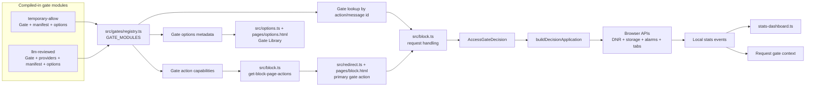

# NoDrift Architecture Notes

This extension keeps a **compiled-in internal module system**. New gates are
added as TypeScript modules under `src/gates/` and compiled into the service
worker bundle. There is no runtime plugin marketplace.

## Source And Release Artifacts

TypeScript source lives under `src/` and compiles to `dist/`. Chrome loads the
compiled background service worker from `dist/`, while Firefox release artifacts
load the same file as a background script. Packaged HTML entrypoints live under
`pages/`. Release ZIPs are runtime-only browser artifacts: they include
`manifest.json`, packaged pages, compiled `dist/`, and manifest-referenced
assets, but not source, tests, docs, dependency folders, or repository metadata.

## Core Registry Flow



The registry is the hinge between gate modules and the extension surfaces. Gate
modules own pure decision logic, block-page labels, and settings metadata. The
background worker owns browser orchestration, side effects, and persistence.

## Core boundaries

- `src/block.ts` remains the background orchestrator for browser APIs.
- Shared access contracts live in `src/core/access-contracts.ts`.
- Compiled-in gate discovery lives in `src/gates/registry.ts`.
- Compiled-in temporary access effects live in `src/access-effects/registry.ts`.
  Effects run after a gate successfully grants access and shape the allowed
  session with CSS or other browser-side friction.
- Decision shaping for temporary allow lives in `src/access-decisions.ts` and
  `src/gates/temporary-allow/`.
- The optional global daily backoff policy is pure logic in
  `src/temporary-allow-delay.ts`; `src/block.ts` persists and enforces pending
  waits before applying one-click temporary access.
- LLM-reviewed request decisions, policy, and provider adapters live in
  `src/gates/llm-reviewed/`.
- Decision-to-application planning lives in `src/core/decision-application.ts`.
- Block-page gate capabilities are derived from the gate registry. Optional
  non-gate integrations, such as ChatGPT peek, still live in
  `src/block-page/block-page-capabilities.ts`.
- `src/redirect.ts` asks the service worker for the current block-page action model
  instead of carrying its own gate registry.
- `dist/options.js` is compiled from `src/options.ts` and renders the Gate Library
  from compiled-in gate module metadata, including each gate's options
  definition.

## Gate module shape

Each gate owns a vertical slice under `src/gates/<gate-name>/`:

```text
src/gates/<gate-name>/
  gate.ts
  manifest.ts
  options.ts
  index.ts
```

Gate-specific dependencies also live inside that folder. For example, the
LLM-reviewed gate owns `policy.ts`, `decision.ts`, and provider adapters in
`providers/`.

The `index.ts` file exports a `GateModule` with the pure gate implementation,
block-page action metadata, and optional settings metadata. `src/gates/registry.ts`
imports those modules and is the single source of truth for compiled-in access
gates.

## Add a new access gate

1. Create a folder under `src/gates/`.
2. Implement the `AccessGate` contract from `src/core/access-contracts.ts` in
   that folder.
3. Accept an `AccessRequestContext` (or a richer specialized context) and return
   an `AccessGateDecision` with one of `PASS`, `PASS_WITH_LIMIT`, `FAIL`, or
   `ASK_FOLLOWUP`.
4. Keep browser API calls out of the gate module.
5. Define the block-page action metadata in the gate's `manifest.ts`.
6. Define settings-page metadata in the gate's `options.ts` when the gate needs
   configuration or explanatory copy.
7. Export a `GateModule` from the gate's `index.ts`.
8. Add the gate module to `src/gates/registry.ts`.
9. Call the gate from `src/block.ts`, then pass the decision through
   `buildDecisionApplication` to apply side effects.

## Add a new block-page action or integration

1. If the action is an access gate, define it in that gate's `manifest.ts`.
2. If the action is not an access gate, add it to
   `src/block-page/block-page-capabilities.ts`.
3. If the action should be selectable as the block page access gate, add it to
   the options page and store its action id in `accessGateActionId`.
4. If it is optional (like ChatGPT peek), register it in
   `OPTIONAL_INTEGRATIONS`.
5. Handle the corresponding message in `src/block.ts` and keep business logic in
   focused modules where possible.

## LLM-reviewed gate notes

- The LLM-reviewed request gate is selectable as a primary block-page action.
- It remains unavailable unless the selected provider settings are ready.
- Provider API keys, when required, are stored in local storage, not sync
  storage.
- Provider payload is intentionally minimal: blocked domain, requested URL, purpose, requested minutes, local time/day, and compact local stats.
- Model output is validated and clamped to the extension's configured duration limits, with invalid output failing closed.
- The flow allows at most one follow-up question before requiring a terminal decision.
