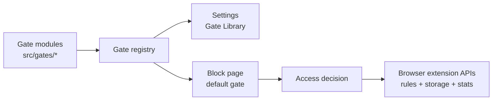

# NoDrift Browser Extension

[Install NoDrift from the Chrome Web Store](https://chromewebstore.google.com/detail/hnehakhgloffpelfgleecfknkpkomhhl)

Chrome is the published target today. Firefox can be built as a local extension
artifact and should be manually verified before AMO submission.

This is a soft website blocker for interrupting autopilot. It redirects
configured distracting domains to a block page, offers a small set of deliberate
access gates, and keeps local stats so patterns are visible without remote
telemetry.

See [PRIVACY.md](PRIVACY.md) for the full privacy policy.

## Architecture At A Glance

The extension is built around compiled-in access gates. A gate is a small
TypeScript module that owns its decision logic, block-page action metadata, and
settings metadata. The central registry makes those gates available to Settings
and to the block page, while the background service worker/script handles
browser API orchestration.



Adding a new gate mostly means adding a folder under `src/gates/`, exporting its
gate module, and registering it. See [ARCHITECTURE.md](ARCHITECTURE.md) for the
detailed registry flow and extension points.

## Quick Start

Use the Node version pinned for this extension:

```sh
nvm use
```

Install the local development tools:

```sh
npm install
```

Run the release confidence checks:

```sh
npm test
```

`npm test` compiles TypeScript and runs the local test suite. npm may print a
local logfile permission warning on some machines; that warning has not affected
the tests.

Compile without running tests when you only need an extension reload:

```sh
npm run build
```

The checked-in manifest is the Chrome shape and loads the background service
worker from `dist/block.js`; the Firefox release artifact rewrites that entry to
`background.scripts`. HTML pages load compiled scripts from `dist/`. Change the
TypeScript sources and rebuild instead of hand-editing generated output.

For an edit loop, run TypeScript in watch mode:

```sh
npx tsc --watch
```

## Release Package

Build and package a runtime-only Chrome Web Store ZIP:

```sh
npm run release:zip
```

Build and package a runtime-only Firefox ZIP:

```sh
npm run release:zip:firefox
```

The package scripts run the release confidence checks first, then write ZIPs to
`release/nodrift-${TARGET}-${VERSION}.zip`, where `TARGET` is `chrome` or
`firefox` and `VERSION` comes from `manifest.version_name` and falls back to
`manifest.version`.

Inspect the artifact before uploading or publishing:

```sh
VERSION="$(node -e "const fs=require('fs'); const m=JSON.parse(fs.readFileSync('manifest.json','utf8')); console.log(m.version_name || m.version);")"
TARGET="firefox"
ZIP="release/nodrift-${TARGET}-${VERSION}.zip"
unzip -l "$ZIP"
```

The ZIP should contain `manifest.json` at the root, packaged extension pages
under `pages/`, compiled files under `dist/`, and manifest-referenced runtime
assets. It should not contain source files, tests, dependency folders, package
metadata, docs, or Git metadata.

To build, verify, and extract a local Chrome-loadable release directory in one
step, run:

```sh
npm run release:validate
```

For Firefox, run:

```sh
npm run release:validate:firefox
```

The validation script runs `npm test`, packages the selected target, checks ZIP
integrity and contents, validates the generated manifest shape, then extracts
the artifact to `release/validate/nodrift-${TARGET}-${VERSION}`.

After the release commit is merged to `main`, create the GitHub release from the
manifest version:

```sh
npm run release:github
```

`release:github` runs `release:validate`, derives the tag and ZIP path from
`manifest.version_name` or `manifest.version`, creates an annotated Git tag,
pushes it to `origin`, and creates a GitHub Release with the Chrome ZIP
attached. Versions with a prerelease suffix, such as `1.0.0-rc.1`, are created
as GitHub prereleases. The command refuses dirty worktrees and non-`main`
branches by default, and asks you to type the tag before publishing.

Preview the GitHub release commands without creating anything:

```sh
npm run release:github -- --dry-run
```

## Load In Chrome

1. Open `chrome://extensions`.
2. Enable Developer mode.
3. Click Load unpacked.
4. Select this directory: `bradlangel/nodrift`.
5. After rebuilding, click the reload button on the extension card.

If Chrome reports manifest or service-worker errors, rebuild with
`npm run build`, reload the extension card, and inspect the service worker from
`chrome://extensions`.

## Load In Firefox

1. Run `npm run release:validate:firefox`.
2. Open `about:debugging#/runtime/this-firefox`.
3. Click Load Temporary Add-on.
4. Select `manifest.json` inside the printed
   `release/validate/nodrift-firefox-${VERSION}` folder.
5. Open the NoDrift toolbar popup and click Enable blocking if Firefox asks for
   site access.

Firefox temporary add-ons are removed when Firefox restarts. Re-run validation
after source changes so the generated Firefox manifest and compiled `dist/`
stay in sync.

Firefox MV3 can leave broad host permissions disabled until the user grants
them. If the popup says blocking needs site access, grant that permission and
reload any already-open blocked tab.

Chrome local AI provider settings are disabled in Firefox because the Chrome
Prompt API is not available there. Use the OpenAI provider path for AI-reviewed
gates in Firefox.

## How It Works

Settings are managed from the extension options page. Blocked sites are stored as
domains, pasted URLs are normalized where possible, duplicate entries are
removed, and overlapping domain entries are called out before saving.

Temporary allow grants wall-clock access for the configured duration. Stats
separately track active usage time, which means a 1 minute grant can expire
after 1 real minute even if only part of that minute was spent on the site. The
Access Effects setting controls what temporarily allowed sites feel like while
access is active. Built-in effects include grayscale and Stale Mode, which
progressively softens media, adds a late page haze, and makes readable text a
little harder to scan as the granted window is used.

The Gate Library chooses the primary access gate shown on the block page. The
maintained overview of compiled-in gates lives in the
[Gate Library (`src/gates/README.md`)](src/gates/README.md), and the in-extension
Settings page shows the same library as selectable gate cards.

The block page can also show configured alternatives, including clickable links,
plus the optional Peek with ChatGPT action. Peek opens ChatGPT with a generated
prompt and page snapshot so the user can inspect information without fully
browsing the site.

The Local Stats page shows today's summary, top blocked domains, per-site
details, top temporary access domains, gate usage, recent decisions, and local
data reset controls.

## Permissions

The extension requests MV3 permissions for the blocker loop:

- `declarativeNetRequest` and `declarativeNetRequestWithHostAccess`: redirect
  configured blocked domains to the extension block page and apply temporary
  allow rules.
- `storage`: save settings, local stats, temporary allow state, and AI provider
  API keys when configured.
- `tabs` and `webNavigation`: track the attempted page, reopen or reload tabs
  after access decisions, maintain the badge, and measure active temporary
  access usage time.
- `contextMenus`: add extension action-menu shortcuts for temporary allow and
  re-block.
- `alarms`: restore blocking rules when temporary access expires and refresh the
  active grant badge and access effects.
- `scripting`: apply or remove Access Effect CSS and support the optional
  ChatGPT peek prompt insertion.
- `clipboardWrite`: copy the ChatGPT peek prompt as a fallback if insertion is
  unavailable.
- `<all_urls>` host access: allow blocking, access effects, navigation, and
  optional peek snapshot flows to work across configured sites.

## Privacy And Local Data

The extension does not send remote telemetry by default. Settings, daily stats,
recent decisions, temporary allow state, and AI provider API keys are stored in
browser extension storage. Some settings may sync across browser profiles if the
browser's extension sync storage is enabled. See [PRIVACY.md](PRIVACY.md) for
the full privacy policy.

The AI-reviewed gate sends data only when that gate is selected and used. For
external providers, such as OpenAI, the review payload includes the requested
purpose, requested URL/domain, requested minutes, current time/day,
provider/model settings, and compact local stats context. For Chrome local AI,
review runs through Chrome's local Prompt API path when available in Chrome.

Peek with ChatGPT is optional. When used, the extension may fetch a small page
snapshot, build a prompt, open ChatGPT, and try to insert that prompt. If prompt
insertion fails, it falls back to the clipboard.

Use [MANUAL_QA.md](MANUAL_QA.md) before tagging or shipping a release.

## Chrome Web Store Assets

The extension icon source and Chrome Web Store listing mockups are kept in the
repo so listing updates stay reproducible. The screenshot PNGs are promotional
store assets and may lead the product UI; do not treat them as canonical UI
screenshots.

Regenerate the store icon, listing screenshots, and optional promo tiles:

```sh
npm run store:assets
```

Render only selected assets by passing their basename:

```sh
npm run store:assets -- screenshot-block-page screenshot-settings
```

Final listing PNGs live in `store-assets/`. Temporary HTML render sources are
written under `store-assets/source/` and ignored by Git.
