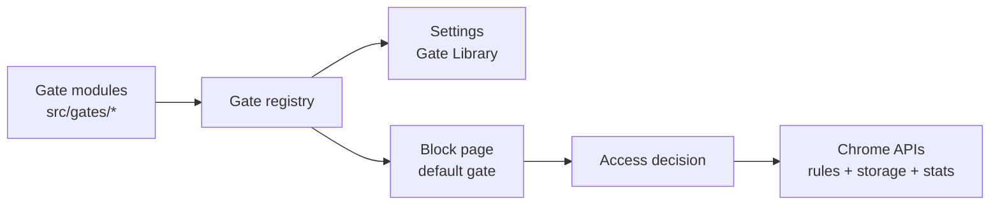

# NoDrift Chrome Extension

Chrome-only for v1. Firefox support is intentionally post-v1.

This is a soft website blocker for interrupting autopilot. It redirects
configured distracting domains to a block page, offers a small set of deliberate
access gates, and keeps local stats so patterns are visible without remote
telemetry.

## Architecture At A Glance

The extension is built around compiled-in access gates. A gate is a small
TypeScript module that owns its decision logic, block-page action metadata, and
settings metadata. The central registry makes those gates available to Settings
and to the block page, while the service worker handles Chrome API orchestration.



Adding a new gate mostly means adding a folder under `src/gates/`, exporting its
gate module, and registering it. See [ARCHITECTURE.md](ARCHITECTURE.md) for the
detailed registry flow and extension points.

## Quick Start

Use the Node version pinned for this extension:

```sh
nvm use
```

Install the local development tools:

```sh
npm install
```

Run the release confidence checks:

```sh
npm test
```

`npm test` compiles TypeScript and runs the local test suite. npm may print a
local logfile permission warning on some machines; that warning has not affected
the tests.

Compile without running tests when you only need a Chrome reload:

```sh
npm run build
```

The extension manifest loads the background service worker from `dist/block.js`,
and the HTML pages load compiled scripts from `dist/`. Change the TypeScript
sources and rebuild instead of hand-editing generated output.

For an edit loop, run TypeScript in watch mode:

```sh
npx tsc --watch
```

## Load In Chrome

1. Open `chrome://extensions`.
2. Enable Developer mode.
3. Click Load unpacked.
4. Select this directory: `bradlangel/nodrift`.
5. After rebuilding, click the reload button on the extension card.

If Chrome reports manifest or service-worker errors, rebuild with
`npm run build`, reload the extension card, and inspect the service worker from
`chrome://extensions`.

## How It Works

Settings are managed from the extension options page. Blocked sites are stored as
domains, pasted URLs are normalized where possible, duplicate entries are
removed, and overlapping domain entries are called out before saving.

Temporary allow grants wall-clock access for the configured duration. Stats
separately track active usage time, which means a 30 minute grant can expire
after 30 real minutes even if only a few minutes were spent on the site. The
grayscale setting applies a temporary CSS filter while access is active.

The Gate Library chooses the primary access gate shown on the block page:

- One-click temporary allow grants domain access for the configured duration.
- Local intent check reviews the stated purpose locally with no provider setup.
- LLM-reviewed request uses an explicit provider configuration. OpenAI sends a
  compact review request through your API key. Chrome local LLM uses Chrome's
  on-device Prompt API path when available.

The block page can also show secondary actions: the configured redirect button
and Peek with ChatGPT. Peek opens ChatGPT with a generated prompt and page
snapshot so the user can inspect information without fully browsing the site.

The Local Stats page shows today's summary, top blocked domains, per-site
details, top temporary access domains, gate usage, recent decisions, and local
data reset controls.

## Permissions

The v1 manifest requests Chrome MV3 permissions for the blocker loop:

- `declarativeNetRequest` and `declarativeNetRequestWithHostAccess`: redirect
  configured blocked domains to the extension block page and apply temporary
  allow rules.
- `storage`: save settings, local stats, temporary allow state, and the OpenAI
  API key.
- `tabs` and `webNavigation`: track the attempted page, reopen or reload tabs
  after access decisions, maintain the badge, and measure active temporary
  access usage time.
- `contextMenus`: add extension action-menu shortcuts for temporary allow and
  re-block.
- `alarms`: restore blocking rules when temporary access expires and refresh the
  active grant badge.
- `scripting`: apply or remove grayscale CSS and support the optional ChatGPT
  peek prompt insertion.
- `clipboardWrite`: copy the ChatGPT peek prompt as a fallback if insertion is
  unavailable.
- `<all_urls>` host access: allow Chrome's blocking, grayscale, navigation, and
  optional peek snapshot flows to work across configured sites.

## Privacy And Local Data

The extension does not send remote telemetry by default. Settings, daily stats,
recent decisions, temporary allow state, and the OpenAI API key are stored in
Chrome storage on this browser profile.

The LLM-reviewed gate sends data only when that gate is selected and used. For
OpenAI, the review payload includes the requested purpose, requested URL/domain,
requested minutes, current time/day, provider/model settings, and compact local
stats context. For Chrome local LLM, review runs through Chrome's local Prompt
API path when available.

Peek with ChatGPT is optional. When used, the extension may fetch a small page
snapshot, build a prompt, open ChatGPT, and try to insert that prompt. If prompt
insertion fails, it falls back to the clipboard.

Use [MANUAL_QA.md](MANUAL_QA.md) before tagging or shipping v1.
